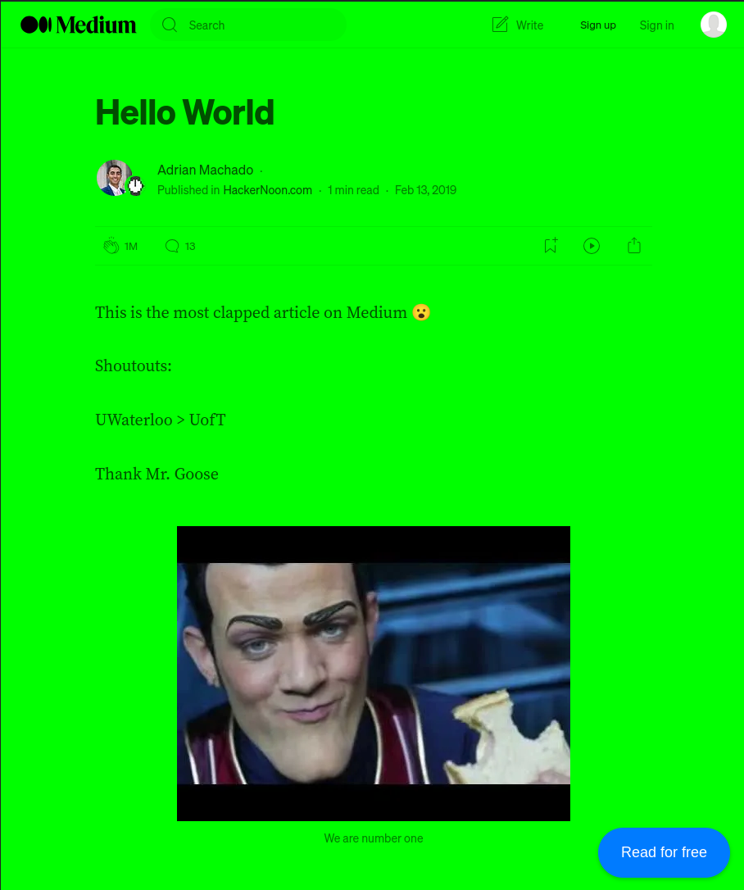
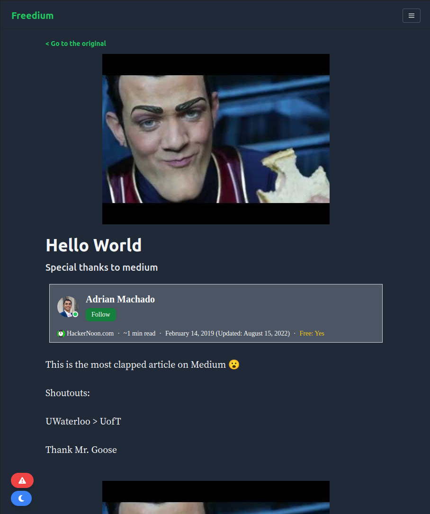

  

# FreeMedium

The FreeMedium Chrome extension allows you to read Medium articles for free by bypassing the paywall thanks to [Freedium](https://github.com/Freedium-cfd). It adds a button to Medium articles, allowing you to access the full content without a subscription.

## Installation

You can install the FreeMedium Chrome extension by following these steps:

1. Download the extension files from the [GitHub repository](https://github.com/fferrin/free-medium).

2. Open Google Chrome and go to the Extensions page by clicking on the three-dot menu in the top right corner, then selecting "More tools" > "Extensions".

3. Enable Developer mode by toggling the switch in the top right corner.

4. Click on the "Load unpacked" button and **select the `extension` folder**.

5. The FreeMedium extension should now be installed and visible in the list of installed extensions.

## Usage

To use the FreeMedium extension:

1. Navigate to any Medium article that is behind a paywall.

2. Click on the "Read for free" button added by the extension at the bottom right corner of the page.

3. Enjoy reading the full content of the article without any restrictions!

## Contributing

Contributions are welcome! If you have any ideas for improving the FreeMedium extension or encounter any issues, feel free to [open an issue](https://github.com/fferrin/free-medium/issues) or submit a pull request.

It appears that Google only approves extensions that request minimal permissions. Since this extension is designed for reading Medium posts, I initially restricted its usage to *.medium.com pages. However, Google rejected the extension from the Chrome Web Store because they don't allow extension to bypass paywalls. Because of that, I released the code so you can see what the extension is doing and, because of that, I'm not restricted to add as many aliases as I want. **If you would like to add other Medium aliases**, please create an [issue](https://github.com/fferrin/free-medium/issues) with the alias(es) you want me to include.

## License

This project is licensed under the [MIT License](https://github.com/git/git-scm.com/blob/main/MIT-LICENSE.txt).

